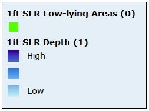
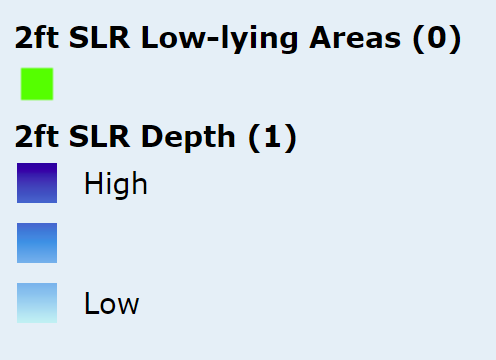
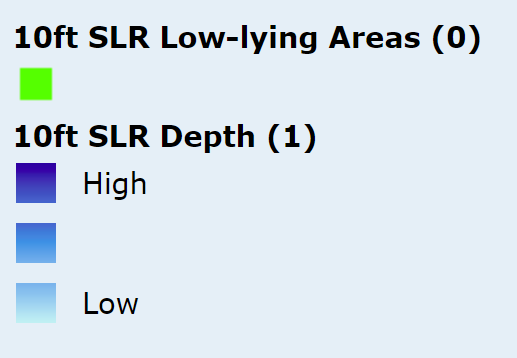
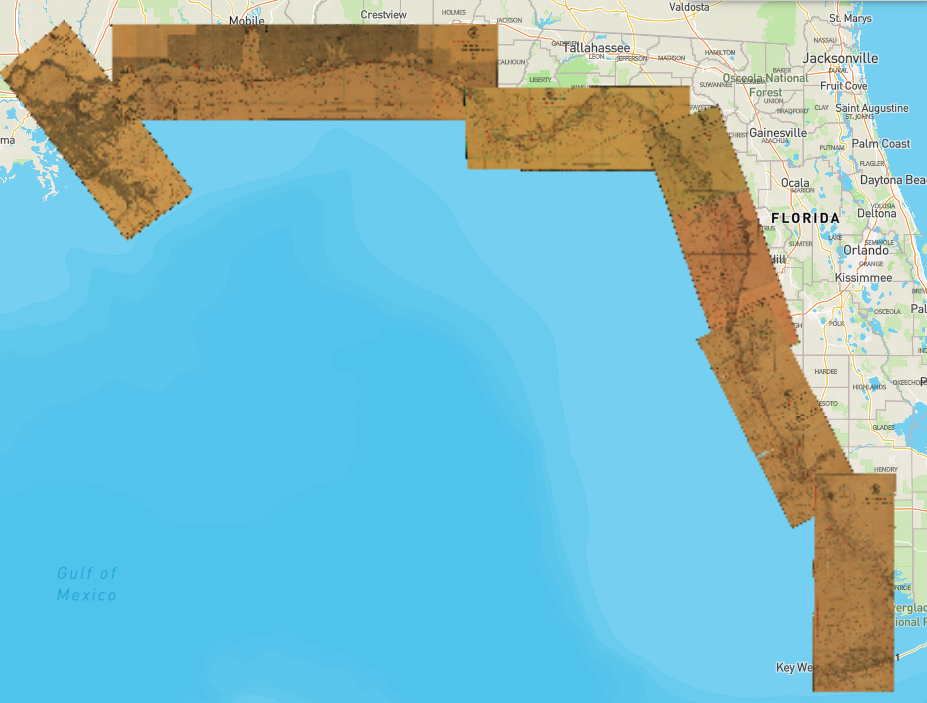
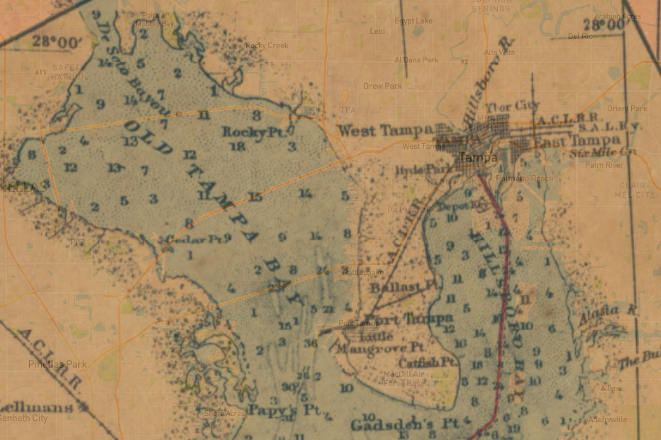

# Map Layers

## Sea-Level Rise

We are adding six overlay layers related to seal-level rise to the map - five different levels of inundation (1ft, 2ft, 3ft, 6ft, 10ft) and a storm surge zones layer. These layers are all available through ArcGIS Online services.

### SLR Inundation Layers

NOAA ArcGIS services are the best source we have for these layers: [coast.noaa.gov/arcgis/rest/services/dc_slr](https://coast.noaa.gov/arcgis/rest/services/dc_slr)

The 1ft layer, for example, is: [coast.noaa.gov/arcgis/rest/services/dc_slr/slr_1ft/MapServer](https://coast.noaa.gov/arcgis/rest/services/dc_slr/slr_1ft/MapServer)

The url for the XYZ tiles works perfectly well in Arches: `https://coast.noaa.gov/arcgis/rest/services/dc_slr/slr_1ft/MapServer/tile/{z}/{y}/{x}`

Django fixture example for the 1ft map layer:

```
[
    {
        "model": "models.mapsource",
        "fields": {
            "name": "slr1-layer",
            "source": {
                "type": "raster",
                "tiles": [
                    "https://coast.noaa.gov/arcgis/rest/services/dc_slr/slr_1ft/MapServer/tile/{z}/{y}/{x}"
                ],
                "tileSize": 256
            }
        }
     },
     {
        "model": "models.maplayer",
        "fields": {
            "name": "1ft Sea Level Rise Inundation",
            "layerdefinitions": [
                {
                    "id": "slr1-layer",
                    "type": "raster",
                    "source": "slr1-layer"
                }
            ],
            "isoverlay": true,
            "activated": false,
            "icon": "none",
            "addtomap": false,
            "centerx": null,
            "centery": null,
            "zoom": null,
            "legend": "",
            "searchonly": false
        }
    }
]
```

To make the legend for each layer we need to create jpg or png images that we'll add to the FPAN app code base. Each layer has legend accessible like this: [https://coast.noaa.gov/arcgis/rest/services/dc_slr/slr_1ft/MapServer/legend](https://coast.noaa.gov/arcgis/rest/services/dc_slr/slr_1ft/MapServer/legend). We just need to make screenshots of these images and then add them to the FPAN codebase.

Sea Level Rise Layer Screenshots:








### Storm Surge Zones

The online source for this layer is here: [https://maps.floridadisaster.org/gis/rest/services/Hazards/Storm_Surge_Zones/MapServer](https://maps.floridadisaster.org/gis/rest/services/Hazards/Storm_Surge_Zones/MapServer/0)

Consuming it as XYZ tiles (just like the SLR layers above) does not seem to work, throwing these errors in the console:

```
Cross-Origin Request Blocked: The Same Origin Policy disallows reading the remote resource at https://maps.floridadisaster.org/GIS/rest/services/Hazards/Storm_Surge_Zones/MapServer/tile/2/1/1. (Reason: CORS header ‘Access-Control-Allow-Origin’ missing).
```

Also tried accessing the layer directly (`.../MapServer/0/tile/...`) but no luck.

Current theory is that this is a configuration on the ArcGIS Online side of things that we can't change, but requires a bit more research.

We could also upload the shapefile to the HMS database and serve it from directly from there as MVT, or serve it through Legion's GeoServer instance. Either of these strategies would work but would require some extra work to style the layers.

## Inside Route - Key West to New Orleans - 1919

This is a historical map set that we georeferenced and uploaded to S3. The tiles are currently generated by an instance of [TiTiler](https://developmentseed.org/titiler) hosted by Legion GIS.



It is very blurry zoomed out, but is quite detailed when zoomed in. The GeoTiffs could probable use a second pass with better GDAL settings (like `-of COG -co COMPRESS=JPEG`).

