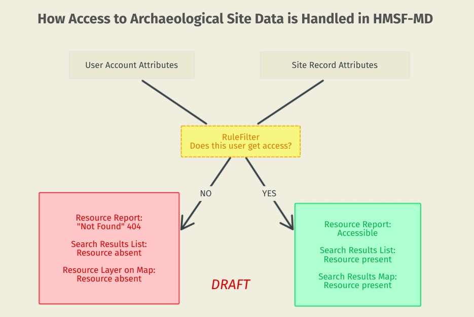
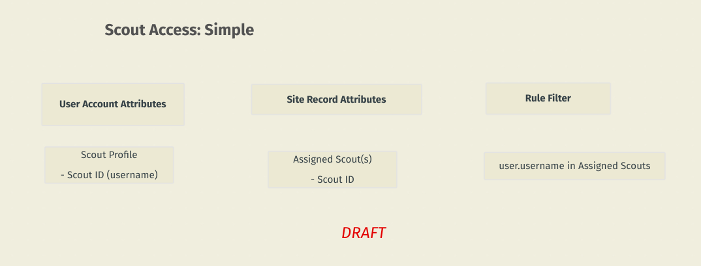
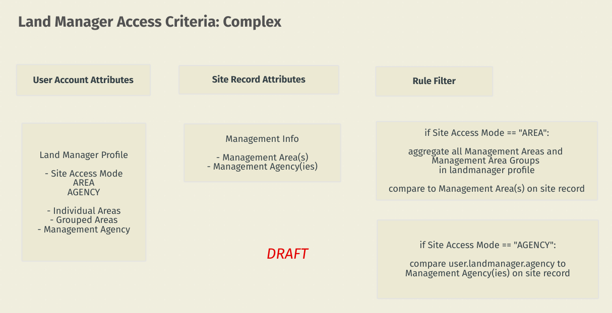
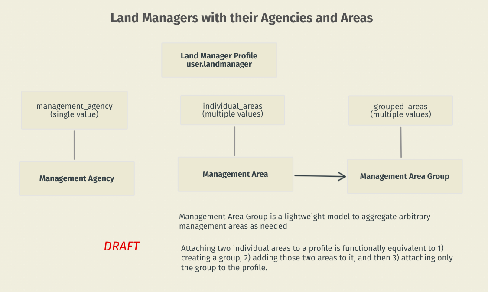

# Rules for Archaeological Site Access

The specific requirements for how we handle access to archaeological site data have changed a bit since 2017 when we first started the project. The current approach aims to be as flexible as possible, while also exposing all components of permissions levels to the Django backend, so FPAN staff can manage the system as easily as possible. This is achieved by combining the following elements:

- User profiles - Scouts vs. Land Managers
   - Site access permissions are handled differently for each category.
   - Each user category has its own login page, and will see different page styles after logging in, but **all users fill out the exact same Scout Report**.
- Management Areas and Management Agencies
   - Used to determine Land Manager site access.
- *Assigned To* and *Management Info* branches on the Archaeological Site resource model
   - Attributes attached to Archaeological Site that are interrogated to determine resource-level access Scouts and Land Managers, respectively.
- The `RuleFilter` custom search component
   - Synthesizes everything described above to alter search queries and results.

This page will give an overview of how these elements are put together.

## Scouts

Scouts are citizens who have registered in order to participate in the Heritage Monitoring Scouts program. **Scouts only get access to individual sites to which they have been assigned.** FPAN staff assign a site to a scout by going to that site's editor view and changing the "Assigned To" node to include the Scout's username.

## Land Managers

On the other hand, Land Managers are employees or staff at various agencies around the state. **Land Managers get access to sites based on how their user profile is configured in the Django admin backend.** Site access is rule-based, with the following modes:

- **FULL** User gets access to *all* sites.
- **NONE** User cannot access any sites.
- **AREA** User can access sites that fall within any of the [Management Areas](#management-areas) (or Management Area Groups) attached to the Land Manager profile
   - *Any combination* of areas or groups can be assigned to a profile
   - In this case, a Management Agency attached to the profile is ignored
- **AGENCY** User can access sites that fall within any Management Areas that are attached to the same agency as the user's profile
   - In this case, any Management Areas or Management Area Groups attached to the profile are ignored

Unerstanding how the **AREA** mode works requires an understanding of how Management Areas function within the system.

## Management Areas

Management Areas are the fundamental component on which Land Manager access hinges. State Parks, FPAN Regions, Conservation Areas, these are all "Management Areas". Each area can have a Management Agency. **Management Area *Names* and *Agencies* are attached to any archaeological site resource that falls within the boundary of the area.**

An extra level of Management Area Groups allow FPAN staff to aggregate multiple areas into a single group that can be assigned to a Land Manager profile. A group could represent a state park district (a regional group of state parks) or any other configuration. A Land Manager can be attached to as many individual or grouped areas as desired.

Each area is defined by the following attribues, some of which reference other classes of database objects.

| Attribute | Description | Function |
|---|---|---|
| Name | Name of area | General identification |
| Management Agency | See [Management Agency](#management-agency) | Used to populate the corresponding node in site resources |
| Category | See [Management Area Category](#management-area-category) | Used to sort areas into map overlays, and to separate FPAN Regions and Counties from other areas |
| Geom | Boundary of area | This boundary is used in a spatial join with site locations to transfer attributes from this area to the resource record.
| Management Level | Federal, State, or County | Used for admin purposes, not used for permissions |
| Description | Extra note about area | Internal use only |
| Load ID | Identifier generated during a bulk load process | This id is used if a Management Area load is reversed |
| Nickname | (deprecated) | -- |

FPAN staff can load new Management Areas through the [Management Area Importer](project:extensions.md#management-area-importer) ETL Module.

### Management Area Category

Category options are stored in a separate database table to allow FPAN staff to add new categories in the future as needed. One map overlay layer will be automaticaly generated for each category. During the management area spatial join, the category of an area is checked becuase two categories are treated a little differently than the others: for *FPAN Region* and *County* areas the area id is placed into different nodes within the site resource (outside of the general Management Areas node).

### Management Agency

Management Agency options are stored in a separate database table to allow FPAN staff to add new agencies in the future as needed. During the management area spatial join, the agency is transferred to the Management Agency node of any sites within the area.

