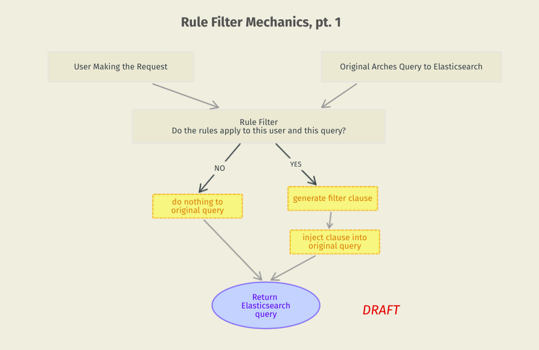
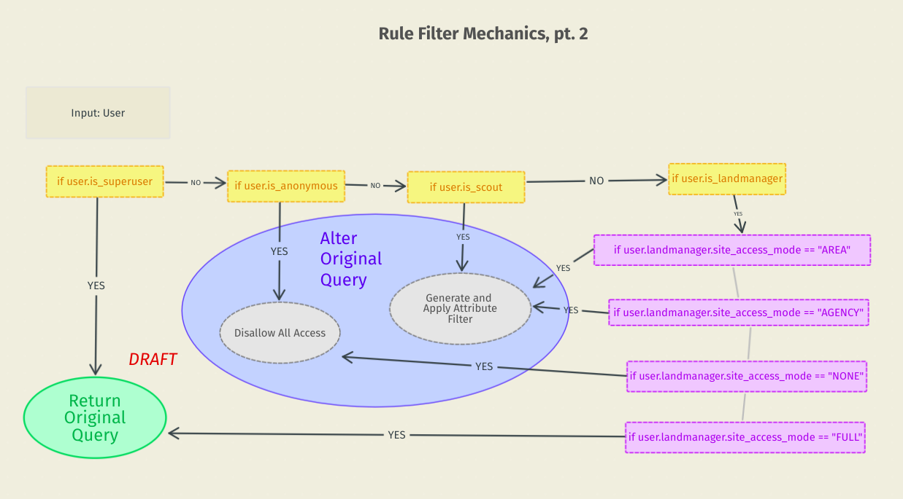

# Search

At the heart of our archaeological site access permission system is a custom search component, `RuleFilter`. While this is an Arches search component that follows traditional patterns, some aspects of it are based on custom user profiles, and attributes that are stored on them.

## `RuleFilter` Search Component

